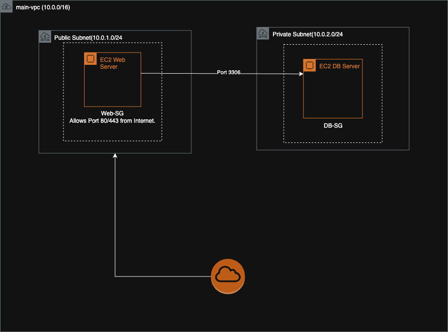

# Secure AWS Landing Zone with Terraform

This project uses Terraform to build a foundational, secure AWS environment from scratch. It demonstrates core cybersecurity and cloud engineering principles by creating a multi-tier network with virtual servers, segmented by public and private subnets, and protected by stateful firewalls.

---

## Architecture Diagram


 

---

## Security Principles Demonstrated

This project was built with the following security best practices in mind:

* **Infrastructure as Code (IaC):** The entire infrastructure is defined as code using Terraform. This ensures the environment is repeatable, version-controlled, and auditable.
* **Network Segmentation:** The VPC is divided into public and private subnets.
    * **Public Subnet:** Hosts public-facing resources (like the web server) and is connected to the internet via an Internet Gateway.
    * **Private Subnet:** Hosts backend resources (like the database server), which are intentionally isolated from the public internet for security.
* **Principle of Least Privilege:** Security Groups are used as stateful firewalls to enforce strict access control.
    * The **web server** security group allows inbound web traffic (HTTP/HTTPS) from anywhere.
    * The **database** security group only allows inbound traffic on the database port (3306) and only from the web server's security group, not from the internet.

---

## How to Run

**Prerequisites:**
* AWS Account & configured credentials
* Terraform installed

1.  **Clone the repository:**
    ```bash
    git clone [https://github.com/your-username/secure-aws-landing-zone.git](https://github.com/your-username/secure-aws-landing-zone.git)
    cd secure-aws-landing-zone
    ```
2.  **Initialize Terraform:**
    ```bash
    terraform init
    ```
3.  **Plan the deployment:**
    ```bash
    terraform plan
    ```
4.  **Apply the configuration:**
    ```bash
    terraform apply
    ```
---

## How to Clean Up

To destroy all the resources created by this project and avoid incurring AWS costs, run:

```bash
terraform destroy
```
